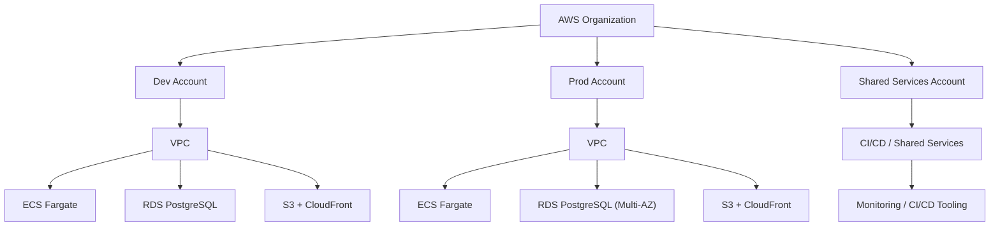
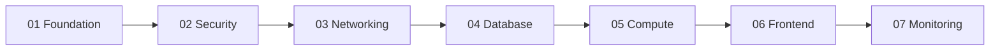

# AWS Enterprise Infrastructure

> Production-ready AWS infrastructure template with enterprise security practices from financial services organizations (RBA, Westpac, CBA). Multi-account organization, ECS Fargate, RDS PostgreSQL, CloudFront CDN, comprehensive monitoring. Optimized for startups: $100-150/month dev, $300-400/month production.

## Public Reference Notice

This repository is maintained as a public reference architecture and learning asset. Patterns are derived from real enterprise delivery experience, but implementation details may be generalized or adapted for safe public sharing.

## Repository Metadata

- Standard name: `waterapps-20-infra-enterprise`
- Depends on: `waterapps-10-bootstrap-oidc-iam` (for CI/CD OIDC/IAM role)
- Provides: Shared/core AWS infrastructure platform (networking, database, compute, frontend, monitoring)
- Deploy order: `20`

[](https://opensource.org/licenses/MIT)
[](https://www.terraform.io/)
[](https://aws.amazon.com/)

## 🎯 What This Is

Enterprise-grade AWS infrastructure that scales from MVP to production, built with 20+ years of DevOps experience from Australian financial institutions. This isn't a toy project—it's the same architectural patterns used at banks and telcos, adapted for startup economics.

**Perfect for:**
- 🚀 Startups needing enterprise credibility
- 💼 Consultants showcasing DevOps expertise  
- 🏢 Scale-ups transitioning from PaaS to AWS
- 📚 Learning production AWS architecture

## ⚡ Quick Start

```bash
# Clone the repository
git clone https://github.com/YOUR_USERNAME/aws-enterprise-infrastructure.git
cd aws-enterprise-infrastructure

# Deploy everything (30 minutes)
./deploy.sh development all

# Stop all costs
./destroy-all.sh
```

**That's it.** You now have enterprise AWS infrastructure.

## 📊 What You Get

### Infrastructure Components

| Component | Technology | Purpose | Monthly Cost |
|-----------|-----------|---------|--------------|
| **Compute** | ECS Fargate + ALB | Container orchestration, auto-scaling | $25-50 |
| **Database** | RDS PostgreSQL 16 | Managed database, automated backups | $15-90 |
| **Frontend** | S3 + CloudFront | Global CDN, static hosting | $1-10 |
| **Networking** | VPC + NAT + Endpoints | Isolated network, secure traffic | $35-90 |
| **Security** | KMS + Secrets Manager | Encryption at rest, credential management | $2-3 |
| **Monitoring** | CloudWatch + SNS | Dashboards, alarms, cost tracking | $1-5 |

**Total: $100-150/month (dev) or $300-400/month (prod)**

### Architecture Features

✅ **Multi-Account Structure** - Separate AWS accounts for dev/prod/shared  
✅ **Bank-Grade Security** - Encryption, audit logs, least-privilege IAM  
✅ **Auto-Scaling** - Handles traffic spikes automatically  
✅ **Cost-Optimized** - Fargate Spot, VPC endpoints, intelligent tiering  
✅ **CI/CD Ready** - GitHub Actions workflow included  
✅ **Full Observability** - CloudWatch dashboards and alarms  
✅ **Disaster Recovery** - Automated backups, multi-AZ production  

## 🏗️ Architecture Overview

### Mermaid Architecture (Client-Friendly)



```
┌─────────────────────────────────────────────────────────────┐
│                     AWS Organization                         │
│  ┌──────────┐  ┌──────────┐  ┌──────────────┐             │
│  │   Dev    │  │   Prod   │  │   Shared     │             │
│  │ Account  │  │ Account  │  │   Services   │             │
│  └──────────┘  └──────────┘  └──────────────┘             │
└─────────────────────────────────────────────────────────────┘
                         │
        ┌────────────────┼────────────────┐
        │                │                │
   ┌────▼────┐     ┌────▼────┐     ┌────▼────┐
   │   VPC   │     │   VPC   │     │   VPC   │
   │         │     │         │     │         │
   │ ┌─────┐ │     │ ┌─────┐ │     │ ┌─────┐ │
   │ │ ECS │ │     │ │ ECS │ │     │ │CI/CD│ │
   │ │Fargate│    │ │Fargate│    │ │Tools│ │
   │ └─────┘ │     │ └─────┘ │     │ └─────┘ │
   │         │     │         │     │         │
   │ ┌─────┐ │     │ ┌─────┐ │     └─────────┘
   │ │ RDS │ │     │ │ RDS │ │
   │ │Postgres│   │ │Multi-AZ│
   │ └─────┘ │     │ └─────┘ │
   │         │     │         │
   │ ┌─────┐ │     │ ┌─────┐ │
   │ │  S3 │ │     │ │  S3 │ │
   │ │+ CF │ │     │ │+ CF │ │
   │ └─────┘ │     │ └─────┘ │
   └─────────┘     └─────────┘
```

## 📁 Repository Structure

```
aws-enterprise-infrastructure/
├── 01-foundation/          # AWS Organization, accounts, SCPs
├── 02-security/            # KMS, Secrets Manager, IAM roles
├── 03-networking/          # VPC, subnets, NAT, security groups
├── 04-database/            # RDS PostgreSQL with backups
├── 05-compute/             # ECS Fargate, ALB, ECR, auto-scaling
├── 06-frontend/            # S3 static hosting + CloudFront CDN
├── 07-monitoring/          # CloudWatch dashboards & alarms
│
├── .github/workflows/      # CI/CD pipeline (GitHub Actions)
├── DEPLOYMENT_ORDER.md     # Step-by-step deployment guide
├── DESTROY_GUIDE.md        # How to tear down infrastructure
├── COST_OPTIMIZATION.md    # Budget analysis and savings tips
├── deploy.sh               # Automated deployment script
└── destroy-all.sh          # Automated destruction script
```

**Deploy in order:** 01 → 02 → 03 → 04 → 05 → 06 → 07  
**Destroy in reverse:** 07 → 06 → 05 → 04 → 03 → 02

### Deployment Order (Mermaid)



## 🚀 Deployment Guide

### Prerequisites

- AWS CLI configured with admin credentials
- Terraform 1.5+
- Three unique email addresses (use Gmail + addressing)
- 30-60 minutes of time

### Step-by-Step

1. **Foundation** (15 min)
   ```bash
   cd 01-foundation
   cp terraform.tfvars.example terraform.tfvars
   # Edit with your email addresses
   terraform init && terraform apply
   ```

2. **Security** (3 min)
   ```bash
   cd ../02-security
   # Create terraform.tfvars with: environment = "development"
   terraform init && terraform apply
   ```

3. **Networking** (5 min)
   ```bash
   cd ../03-networking
   terraform init && terraform apply
   ```

4. **Database** (10 min)
   ```bash
   cd ../04-database
   terraform init && terraform apply
   # Wait for RDS provisioning
   ```

5. **Compute** (10 min)
   ```bash
   cd ../05-compute
   # Push Docker image to ECR first!
   terraform init && terraform apply
   ```

6. **Frontend** (10 min)
   ```bash
   cd ../06-frontend
   terraform init && terraform apply
   # Upload static files to S3
   ```

7. **Monitoring** (5 min)
   ```bash
   cd ../07-monitoring
   terraform init && terraform apply
   # Confirm SNS email subscription
   ```

**See [DEPLOYMENT_ORDER.md](DEPLOYMENT_ORDER.md) for detailed instructions.**

## 💰 Cost Management

### Monthly Costs by Environment

| Environment | Configuration | Monthly Cost |
|------------|---------------|--------------|
| **Development** | Single-AZ, Fargate Spot, minimal monitoring | $100-150 |
| **Production** | Multi-AZ, standard Fargate, enhanced monitoring | $300-400 |
| **Paused Dev** | Compute stopped, infrastructure remains | $50-70 |
| **Destroyed** | Everything deleted except snapshots | $0-2 |

### Cost Optimization Strategies

- **Fargate Spot**: 50% savings on compute (already enabled in dev)
- **VPC Endpoints**: Avoid NAT charges for AWS services
- **Single NAT Gateway**: $35/month savings in dev vs multi-AZ
- **Intelligent Tiering**: Automatic S3 storage class optimization
- **Right-Sizing**: Start small, scale based on actual usage

**See [COST_OPTIMIZATION.md](COST_OPTIMIZATION.md) for detailed analysis.**

## 🔒 Security Features

- **Encryption at Rest**: KMS for all data stores (RDS, S3, EBS)
- **Secrets Management**: No hardcoded credentials, all in Secrets Manager
- **Network Isolation**: Private subnets for compute and database
- **Least Privilege IAM**: Task-specific roles, no admin access
- **Audit Logging**: CloudTrail across all accounts
- **Security Scanning**: ECR image scanning, automated security patches
- **MFA Enforcement**: Required for critical operations (production)

## 📈 Scaling Path

| Stage | Users | Config | Cost/Month |
|-------|-------|--------|------------|
| **MVP** | <100 | 1 Fargate task, db.t4g.micro | $100-150 |
| **Growth** | 100-1K | 2-4 tasks, db.t4g.small | $300-400 |
| **Scale** | 1K-10K | 4-10 tasks, db.r6g.large | $800-1200 |
| **Enterprise** | 10K+ | 10+ tasks, db.r6g.xlarge, multi-region | $2000+ |

Infrastructure scales seamlessly—just adjust task counts and instance sizes.

## 🛠️ Operations

### Daily Operations
```bash
# Check service health
aws ecs describe-services --cluster dev-cluster --services dev-backend

# View logs
aws logs tail /ecs/development-waterapps --follow

# Check costs
aws ce get-cost-and-usage --time-period Start=2025-02-01,End=2025-02-07 \
  --granularity DAILY --metrics BlendedCost
```

### Deploying Updates
```bash
# Backend: Build + push to ECR, ECS auto-deploys
docker build -t $ECR_URL:latest .
docker push $ECR_URL:latest

# Frontend: Sync to S3, invalidate CloudFront
aws s3 sync ./build s3://$BUCKET/
aws cloudfront create-invalidation --distribution-id $DIST_ID --paths "/*"
```

### Emergency Procedures
```bash
# Scale to zero (emergency cost stop)
aws ecs update-service --cluster dev-cluster --service dev-backend --desired-count 0

# Complete teardown
./destroy-all.sh
```

## 🎓 What You'll Learn

By deploying this infrastructure, you'll understand:

- ✅ Multi-account AWS Organizations architecture
- ✅ Service Control Policies (SCPs) for governance
- ✅ ECS Fargate container orchestration
- ✅ Application Load Balancer configuration
- ✅ RDS database management and backups
- ✅ CloudFront CDN with OAC security
- ✅ KMS encryption key management
- ✅ Secrets Manager for credentials
- ✅ VPC networking and security groups
- ✅ CloudWatch monitoring and alerting
- ✅ Infrastructure as Code with Terraform
- ✅ CI/CD pipeline automation

## 📚 Documentation

- **[EXECUTIVE_SUMMARY.md](EXECUTIVE_SUMMARY.md)** - Strategic overview and business case
- **[DEPLOYMENT_ORDER.md](DEPLOYMENT_ORDER.md)** - Why this sequence matters
- **[QUICK_START.md](QUICK_START.md)** - 30-minute deployment walkthrough
- **[DESTROY_GUIDE.md](DESTROY_GUIDE.md)** - Safe teardown procedures
- **[COST_OPTIMIZATION.md](COST_OPTIMIZATION.md)** - Budget analysis and savings
- **[BACKEND_CONFIG.md](BACKEND_CONFIG.md)** - Terraform state management
- **[docs/TERRAFORM_DRIFT_GOVERNANCE_POLICY.md](docs/TERRAFORM_DRIFT_GOVERNANCE_POLICY.md)** - Drift prevention policy, controls, and remediation model

## 🤝 Contributing

This repository represents enterprise patterns learned over 20+ years in financial services and telco DevOps. Contributions welcome, especially:

- Cost optimization techniques
- Security enhancements
- Additional AWS service integrations
- Documentation improvements

## 📄 License

MIT License - Use this in your own projects, modify as needed, no attribution required.

## 🎯 Who Built This

Built by a DevOps engineer with 20+ years experience at:
- Reserve Bank of Australia (RBA)
- Westpac Banking Corporation  
- Commonwealth Bank of Australia (CBA)
- Telstra
- Optus

This is the same level of infrastructure used at these organizations, optimized for startup budgets.

## ⚠️ Disclaimer

This infrastructure is provided as-is. While it follows enterprise best practices, you're responsible for:
- AWS costs incurred
- Security configuration for your specific use case
- Compliance with your industry regulations
- Monitoring and maintaining your deployment

Always test in development before deploying to production.

## 🚀 Next Steps

1. **Deploy development environment** - Validate it works
2. **Customize for your app** - Update container images, database schemas
3. **Set up CI/CD** - Automate deployments with GitHub Actions
4. **Monitor costs** - Check daily, optimize after 1 week
5. **Deploy production** - When you have paying customers

Questions? Issues? Open a GitHub issue or discussion.

---

**⭐ Star this repo if it helped you!**

## Architecture

```
├── 01-foundation/       # AWS Organization, accounts, IAM Identity Center
├── 02-security/         # KMS, Secrets Manager, IAM roles  
├── 03-networking/       # VPCs, subnets, security groups
├── 04-database/         # RDS PostgreSQL
├── 05-compute/          # ECS Fargate cluster and services
├── 06-frontend/         # S3 + CloudFront CDN
├── 07-monitoring/       # CloudWatch, alarms, dashboards
└── modules/             # Reusable Terraform modules (future)
```

**Deploy in order:** 01 → 02 → 03 → 04 → 05 → 06 → 07  
**Destroy in reverse:** 07 → 06 → 05 → 04 → 03 → 02 (keep 01)

## Prerequisites

1. AWS CLI configured with appropriate credentials
2. Terraform >= 1.5.0
3. An AWS account with Organization creation permissions

## Quick Start

### Phase 1: Foundation (Week 1)
```bash
cd foundation
terraform init
terraform plan
terraform apply
```

### Phase 2: Security & Networking (Week 1-2)
```bash
cd ../security
terraform init && terraform apply

cd ../networking
terraform init && terraform apply
```

### Phase 3: Core Infrastructure (Week 2-3)
```bash
cd ../database
terraform init && terraform apply

cd ../compute
terraform init && terraform apply

cd ../frontend
terraform init && terraform apply
```

### Phase 4: Monitoring (Week 3-4)
```bash
cd ../monitoring
terraform init && terraform apply
```

## Cost Optimization

This infrastructure is optimized for MVP phase:
- Single-AZ RDS (upgrade to Multi-AZ when revenue justified)
- Fargate Spot for dev environment
- S3 Intelligent-Tiering
- CloudWatch log retention tuned for startup

**Estimated Monthly Cost**: $150-300 (depending on traffic)

## Deployment Environments

- **Development**: Cost-optimized, single-AZ, relaxed security
- **Production**: Enhanced availability, encrypted, multi-AZ when needed

## State Management

Each module uses S3 backend with state locking via DynamoDB.
Configure in `backend.tf` for each module.

## Security Features

- Encryption at rest (KMS)
- Secrets Manager for credentials
- IAM least-privilege roles
- CloudTrail audit logging
- Security group restrictions
- WAF ready (optional)

## Next Steps

1. Customize `variables.tf` in each module
2. Set up state backend (S3 + DynamoDB)
3. Deploy foundation first
4. Follow incremental deployment phases
5. Configure CI/CD pipeline integration

## Support

Built for VK's DevOps expertise. Leverage your RBA/PFB experience for enterprise clients while keeping costs lean for MVP.
